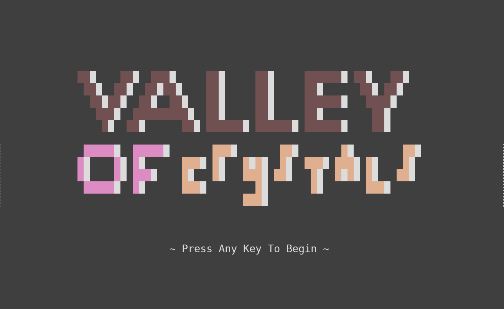

# QPlex

Interpreted graphics environment with the aim of minimal specification and ergo high cross-platform support.

## Background

This project is more or less a rewrite of [Teaspoon](https://github.com/SamyBencherif/Teaspoon). The main difference is that I am taking special steps to reduce the implementation difficult. (1) I am not making any transpilers this time. (2) I have reduced the graphics commandset to the actual bare minimum. (3) I am emphasizing extensibility. And finally (4) I am putting most of the effort into the language design itself, while still avoiding frills (such as a different nonymous and anonymous function declaration).

In a sense this project is a precursor to MaKeMo, a project I've documented on my website and in chat rooms somewhat. MaKeMo is an attempt to make programming and game design while on-the-go worthwhile and effective. Primary features will be detailed mobile-optimized editors and interfaces and cross platform user programs. But this is a lot of work... And it takes time.

Until then, I still have Pythonista. An iPhone app that allows for graphics coding on-the-go, but it I've always found it annoying that I may invest time making a Pythonista game only for it to be difficult to bring to the desktop. QPlex serves as a layer to solve this problem for me.

But what about about [Pythonista-OpenGL-binding](https://github.com/SamyBencherif/Pythonista-OpenGL-binding)?? Good point, rhetorical Samie. That is another project with many pieces that takes time to build. It still does not implement all of Pythonista's features. It is entirely missing the UI module. 

## Motivation

I intend to run a QPlex interpreter within Pythonista, that way any program I write will definitely not only be compatible with any other QPlex interpreter but it will also produce exactly identical results everywhere it's run.

The most appealing part of this project is that since QPlex interpreters should be relatively easy to write, it won't take long to implement a desktop interpreter, a web based one, a pinephone one, and even one for the [Remarkable 2](https://remarkable.com/) tablet!

That point is especially important considering my intent to focus on extensibility. That means all graphics, input, and data management features I devise in common.qpl will instantly be available to all those platforms. Hallelujah. In a way this like being able to develop QPlex itself while on the go !

## Basics

On any given platform the following items will be needed.

(1) a QPlex interpreter

(2) the common.qpl 'kitchen-sink' library

The whole point of all of this is that I put as much of the implementation in common.qpl as reasonably possible. The reason is that I will have to write a seperate QPlex interpreter for every supported platform, while I only need to write common.qpl ONE time.

I'm even implementing the for-loop in common.qpl ! That should indicate somewhat the level of extensibility I'm going for :) 

## Scope

This is an interpreted graphics environment that runs on mobile devices and is cutting corners to reduce implementation size. This will NOT be a performant library. This library is for exceedingly simple little games such as [this](http://bensa.games/sketches/UNTITLED_MAZE/) one or maybe even [this](http://bensa.games/sketches/CONVOS_OF_THE_VOID/) other one. These are the kind of games where it's nothing but a shame that they cannot be run on every platform. It's also a shame they cannot be worked on on-the-go.

The second game example is text-based ! Text is more or less outside the scope of the interpreter specification. I may include a convenience function `print` that leverages any obvious platform specific methods for displaying text. This would of course violate the premise that program output should be identical. As such it would be an UNSUPPORTED UNDEFINED implementation feature.

Likely I will eventually make a supported `text` function within common.qpl. It will rely on either one of my existing bitmap fonts or perhaps a new smaller one. The output will surely look silly if I ever build an [ansi](https://github.com/SamyBencherif/Codepad) [term](https://github.com/SamyBencherif/ncknge/blob/master/src/ncknge.c) interpreter for this...

It would make block text like this (from Ncknge), except less stylized...

